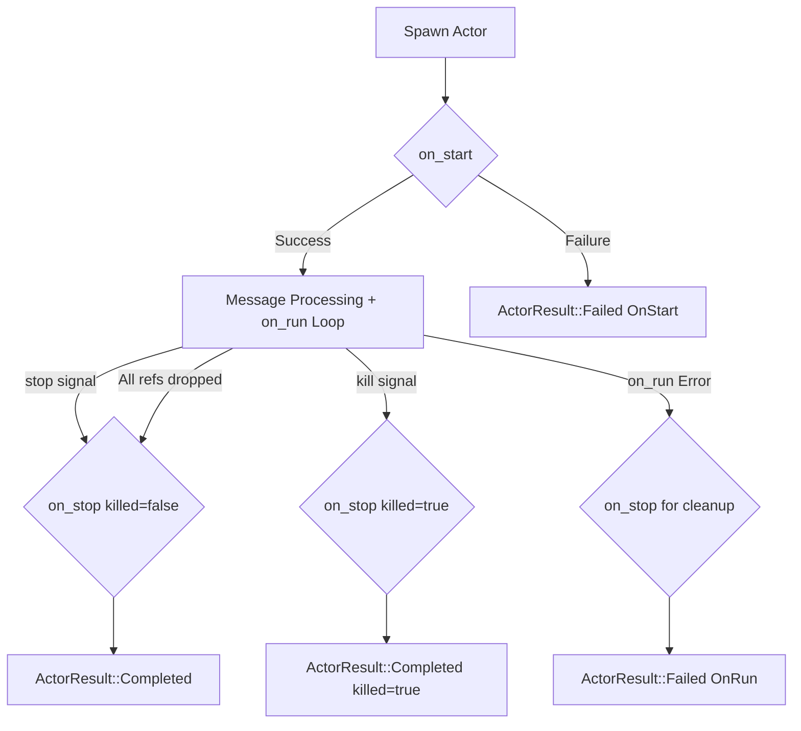

## Actor Lifecycle

Actors in `rsActor` go through a well-defined lifecycle. Understanding this lifecycle is crucial for managing actor state, resources, and behavior correctly.

The lifecycle consists of several stages, with specific methods (hooks) in the `Actor` trait that you can implement to customize behavior at each stage:

1.  **Spawning**: An actor's lifecycle begins when it is spawned using `rsactor::spawn()` or `rsactor::spawn_with_mailbox_capacity()`.

2.  **Starting (`on_start`)**: Once spawned, the framework calls `on_start`.
    *   **Purpose**: Initialize the actor's state. It receives the arguments passed during `spawn()` and an `ActorRef` to itself.
    *   **Required**: This method *must* be implemented.
    *   **Outcome**: Return `Ok(Self)` with the initialized actor instance or `Err` if initialization fails. If `on_start` fails, the `ActorResult` will be `Failed` with `FailurePhase::OnStart`.

    ```rust
    async fn on_start(args: Self::Args, actor_ref: &ActorRef<Self>) -> Result<Self, Self::Error> {
        // Initialize state, acquire resources
        Ok(Self { /* ... */ })
    }
    ```

3.  **Running (`on_run`)**: After `on_start` succeeds, `on_run` is called as an idle handler when the message queue is empty.
    *   **Purpose**: Background processing or periodic tasks. Messages always have higher priority.
    *   **Optional**: Defaults to `Ok(false)` (called once, then disabled).
    *   **Return values**:
        - `Ok(true)`: Continue calling `on_run`
        - `Ok(false)`: Stop calling `on_run`, only process messages
        - `Err(e)`: Terminate the actor with an error
    *   **Note**: Receives `&ActorWeak<Self>`, not `&ActorRef<Self>`.

    ```rust
    async fn on_run(&mut self, actor_weak: &ActorWeak<Self>) -> Result<bool, Self::Error> {
        // Perform idle processing when message queue is empty
        Ok(false)
    }
    ```

4.  **Message Processing**: The actor concurrently handles incoming messages and executes `on_run`. Messages are always given priority via `biased` `tokio::select!`.

5.  **Stopping (`on_stop`)**: The actor can be stopped in several ways:
    *   **Graceful Stop**: `actor_ref.stop().await?` — processes remaining messages first.
    *   **Immediate Kill**: `actor_ref.kill()` — stops immediately.
    *   **Error in `on_run`**: `on_stop` is called for cleanup before termination.
    *   **All references dropped**: When all `ActorRef` instances are dropped.

    The `killed` parameter distinguishes the termination mode:

    ```rust
    async fn on_stop(&mut self, actor_weak: &ActorWeak<Self>, killed: bool) -> Result<(), Self::Error> {
        if killed {
            println!("Forcefully terminated, performing minimal cleanup");
        } else {
            println!("Gracefully shutting down, performing full cleanup");
        }
        Ok(())
    }
    ```

6.  **Termination**: After `on_stop` completes, the actor's Tokio task finishes. The `JoinHandle` resolves with an `ActorResult<T>`:
    *   `ActorResult::Completed { actor, killed }` — successful completion
    *   `ActorResult::Failed { actor, error, phase, killed }` — failure with details

### Graceful Stop vs. Kill

| Feature | `stop()` | `kill()` |
|---------|----------|----------|
| Drains mailbox | Yes | No |
| `on_stop` called | Yes | Yes |
| `killed` parameter | `false` | `true` |
| Blocking | Async (`await`) | Synchronous |

### Visualizing the Lifecycle



Understanding these lifecycle hooks allows you to build actors that manage their resources and state reliably throughout their existence.
